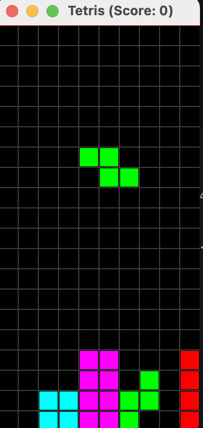

# Tetris



The iconic Tetris puzzle game implemented in Java, complete with music! Rotate and place falling pieces to clear lines, score points, and prevent the board from filling up.

### Features
- Classic Tetris gameplay with falling tetrominoes
- Piece rotation, movement, and hard drop
- Line-clearing and score tracking
- Game-over detection
- Background grid rendering
- Background music
- Java Swing-based graphical interface

Built to explore grid-based game mechanics, object-oriented programming, user input, and GUI development.

## Getting Started

### Prerequisites

- Java 11 or newer (JDK 11+)
- A terminal or IDE capable of running Java applications

### Running the Game

Clone the repository and run from the project root:

```bash
javac *.java
java Tetris
```

## Usage

Run the `Tetris` class to launch the game. A game window will appear displaying the playfield and the current falling piece. The game may take a few seconds to initialize.

For the best experience, turn your sound on!

### Controls

| Key | Action |
|------|----------|
| ← → | Move piece left/right |
| ↓ | Soft drop |
| ↑ | Rotate piece |
| Space | Hard drop |

### Gameplay

- Arrange falling pieces to complete horizontal lines.
- Completed lines are cleared and award points.
- As the game progresses, pieces continue to stack.
- The game ends when a new piece can no longer enter the playfield.

## Acknowledgements

This project was inspired by the classic Tetris puzzle game and was developed as a learning exercise in grid-based game programming.

Special thanks to Ryan Adolf, the BlueJ/Blocks library team, and Anu Datar's AP Computer Science Data Structures course (2023) for the original project framework, testing code, and educational materials. The project also draws inspiration from the GridMonster creators and JUnit-style testing.

## Author

Linda Zeng

## License

This project is licensed under the MIT License. See the LICENSE file for details.
